# NegotiationCoach AI — Architektur

## Letzte Aktualisierung

| Datum | Geänderte Dateien / Anlass |
|-------|---------------------------|
| 2026-07-02 | Initiale Erstellung — analysiert: `negotiation-buddy/src/` (Frontend), `negotiationcoach-backend/src/` (Backend), `shared-context/docs/` (ADRs, Contracts, Edge Functions) |

---

## Systemüberblick

NegotiationCoach AI ist eine React-SPA (`negotiation-buddy`), gestützt durch zwei Laufzeit-Services: einen Express-Backend (Render.com) für LLM-Orchestrierung und Layer-1/2/3-Analysen sowie Supabase für Auth, PostgreSQL und Streaming-Edge-Functions (Deno). Der Haupt-Chat läuft als Server-Sent-Events (SSE) über eine Supabase Edge Function; alle strukturierten Analysen, Session-Persistenz und Business-Logik laufen über das Express-Backend. Eine `AnalysisContext`-Schicht im Browser (localStorage, 7-Tage-TTL) hält den globalen Session-State zwischen Tool-Navigationen konsistent.

---

## 1. User Flows

Die vier zentralen User-Journeys: Auth-Flow (Login, Signup, Password Reset), der Haupt-Verhandlungscoach-Flow (Guided Onboarding → Chat → Fortschrittsanalyse → Plan → Marktdaten), Tool-Navigation als nested-route Overlay (Index bleibt gemountet), und die Layer-3-Gegner-Simulation (Profi-Tier only).

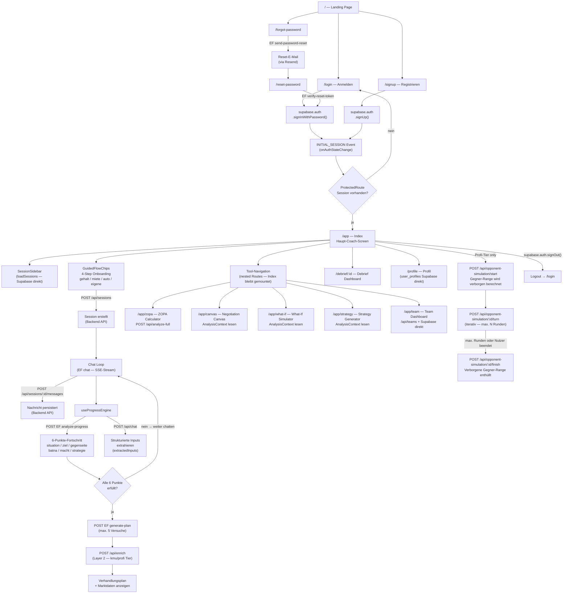

---

## 2. Datenflüsse

Vier kritische Datenflüsse: (A) der Chat-Nachricht-Flow mit SSE-Streaming, (B) der Fortschritts- und Plan-Generierungs-Flow, (C) der Layer-1+2-Analyse-Flow (ZOPA Calculator), und (D) der Layer-3-Gegner-Simulations-Flow. Alle Flows nutzen Supabase-JWT als Bearer-Token für Backend und Edge-Function-Calls.

### A — Chat-Nachricht-Flow (SSE-Streaming)

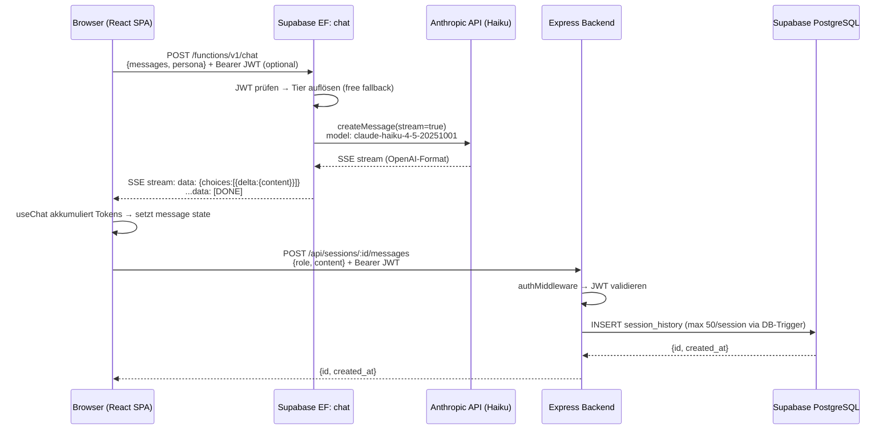

### B — Fortschritts- und Plan-Generierungs-Flow

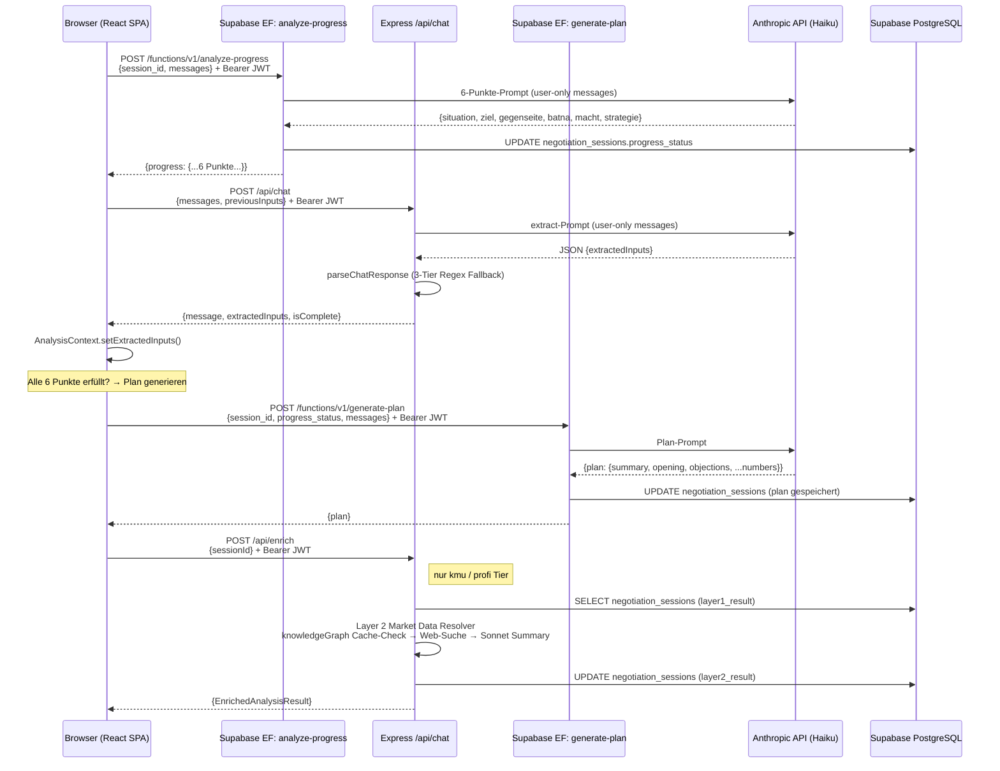

### C — Layer-1+2-Analyse-Flow (ZOPA Calculator)

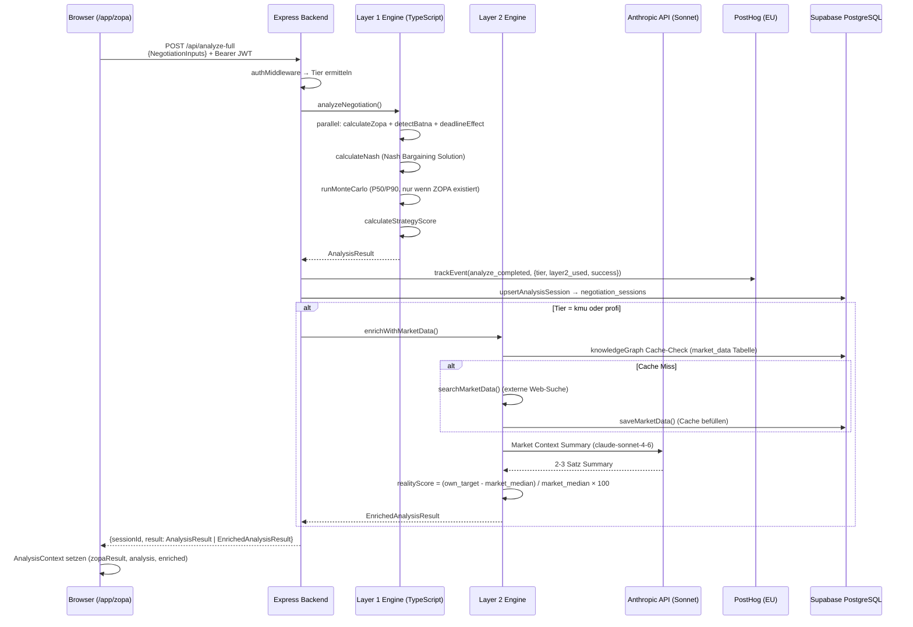

### D — Layer-3-Gegner-Simulations-Flow (Profi-Tier)

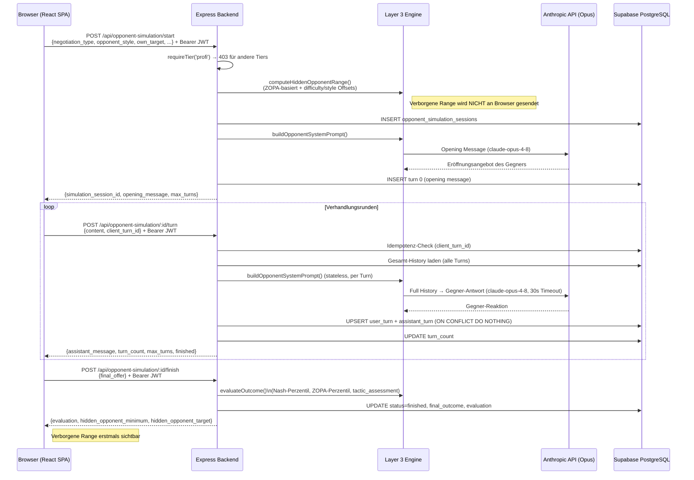

---

## 3. Architektur & Service Boundaries

Alle drei Laufzeit-Services kommunizieren über HTTPS/JSON (Backend) oder HTTPS/SSE (Edge Functions). Das Frontend ist der einzige Initiator von Calls — es gibt keine Service-to-Service-Kommunikation außer Backend → Supabase (service_role) und Backend → Anthropic. Der Browser hält keinen direkten Kontakt zur Anthropic API; alle LLM-Calls werden entweder über das Express-Backend oder die Supabase-Edge-Functions proxied.

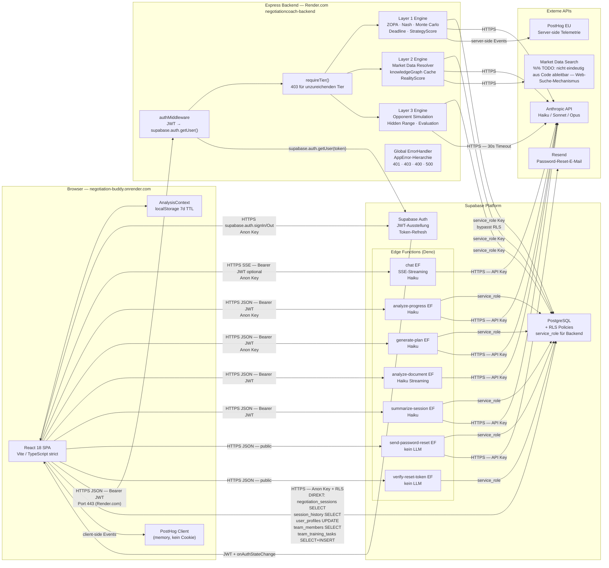

### Model-Routing nach Layer und Tier

| Layer / Endpoint | Haiku | Sonnet | Opus |
|-----------------|-------|--------|------|
| EF chat (alle Tiers) | ✓ | — | — |
| EF analyze-progress | ✓ | — | — |
| EF generate-plan | ✓ | — | — |
| EF analyze-document | ✓ (Streaming) | — | — |
| Backend /api/chat (free fallback) | ✓ | — | — |
| Backend /api/chat (standard) | — | ✓ | — |
| Backend Layer 2 Market Summary | — | ✓ (immer) | — |
| Backend /api/opponent-simulation | — | ✓ (Fallback) | ✓ (profi) |
| Backend /api/plan (inaktiv) | — | ✓ | — |

---

## 4. Error Handling

Jeder kritische Flow hat eine eigene Fehlerbehandlungs-Schicht. Grundprinzip: LLM-Calls und externe Abhängigkeiten sind isoliert (Failure → Fallback/Silent), Auth-Fehler sind hart (401/403), Session-Loads haben Timeouts gegen PostgREST-Hänger, und Plan-Generierung hat einen dedizierten Retry-Mechanismus.

### A — Chat-Fehler und SSE-Fehler

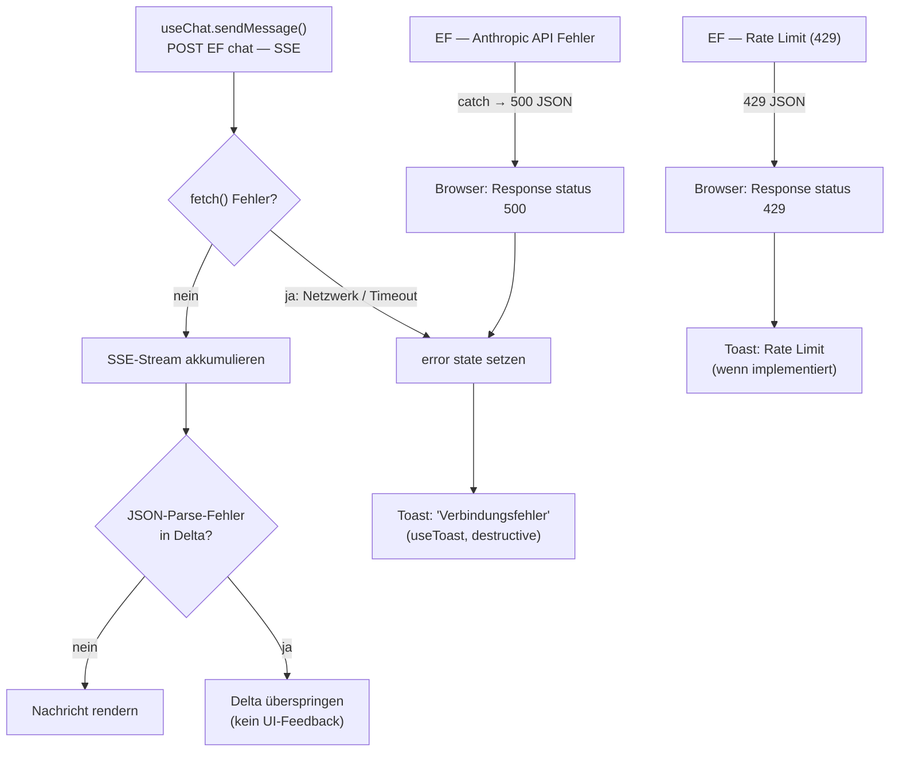

### B — Session-Load mit Timeout (PostgREST-Schutz)

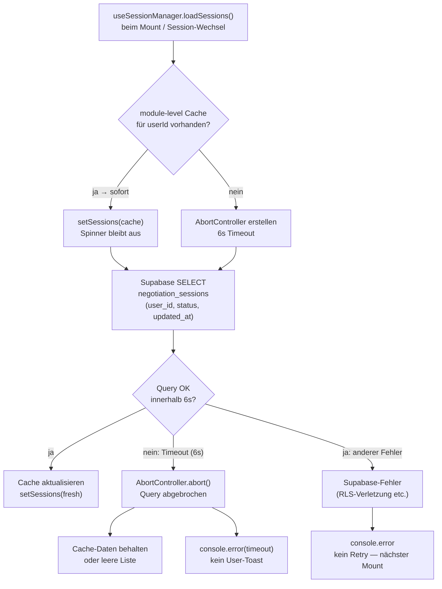

### C — Auth-Token-Refresh-Fehler

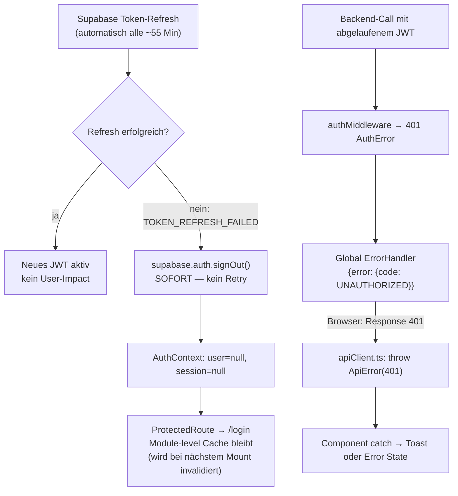

### D — Plan-Generierungs-Retry-Logik

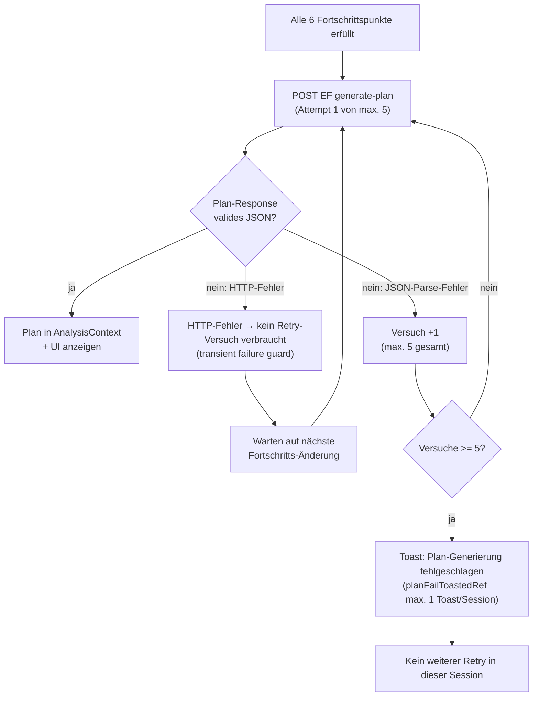

### E — Layer-2-Enrichment-Fehler (Silent Failure by Design)

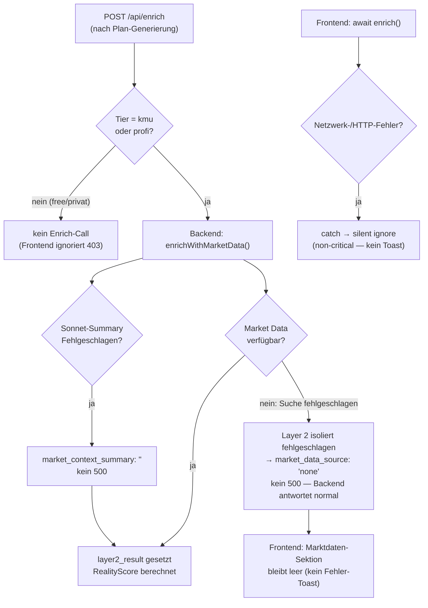

### F — Opponent-Simulation: Idempotenz und Fehlerisolation

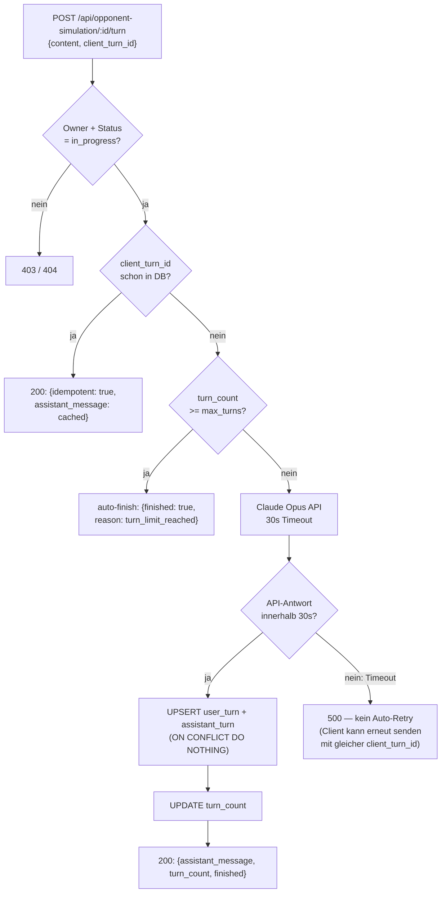

---

## Anhang: Bekannte Architektur-Schulden

| ID | Severity | Beschreibung | Status |
|----|----------|-------------|--------|
| HIGH-01 | High | Frontend schreibt `user_profiles` noch direkt via Supabase (Profile.tsx) | Offen |
| HIGH-01 | High | `team_members`, `team_training_tasks` noch direkt via Supabase gelesen (TeamDashboard.tsx) | Offen |
| HIGH-01 | High | `negotiation_sessions` / `session_history` noch direkt via Supabase gelesen (useSessionManager) | Offen |
| MED-01 | Medium | `modelRouter` in `/api/chat` und `/api/plan` bypassed — kein Tier-basiertes Model-Routing | Offen |
| MED-02 | Medium | CORS-Wildcard-Header überschreibt Allowlist in Express-Backend | Offen |
| — | Info | `/api/plan` (Backend) deklariert aber inaktiv — aktiver Pfad: EF `generate-plan` (ADR-005) | Dokumentiert |

Vollständiger Befund: `docs/audits/current-state-report.md`
